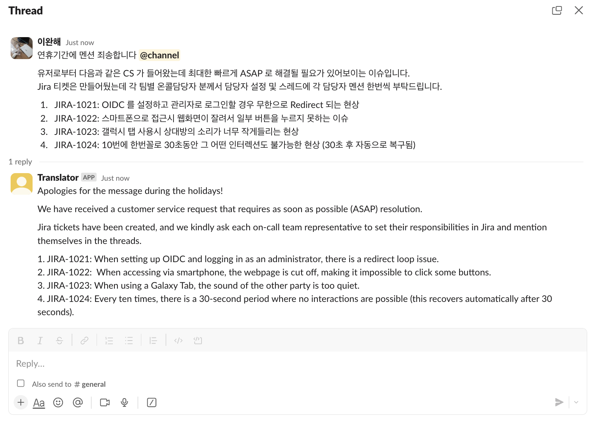

# Slack Translation Bot

A Slack bot that provides real-time translation from whatever language to
English services using Ollama's local language models.

## Features

- Listens to Slack messages in real-time using Socket Mode
- Translates messages to English using Ollama's Gemma 2 9B model
- Maintains formal, business-appropriate language in translations

## Prerequisites

- Deno runtime
- Ollama installed locally
- Slack App and Bot tokens

## Setup

1. Clone the repository
2. Create a `.env` file with your Slack tokens:
   ```
   SLACK_APP_TOKEN=your_app_token_here
   SLACK_BOT_TOKEN=your_bot_token_here
   ```
3. Ensure Ollama is running with the Gemma 2 9B model

## Usage

Run the bot with Deno:

```
deno task dev
```

## Why not using DeepL or Google Translate?

1. They are not free.
2. We need to keep our conversations private and secure.
3. We could change the tone and style of translation by editing the prompt.

## Demo



In case you want to test how other translators translate the above message,
here's the original message you can copy and paste:

<details>
<summary>Original Message</summary>

<br>
연휴기간에 멘션 죄송합니다 @channel
유저로부터 다음과 같은 CS 가 들어왔는데 최대한 빠르게 ASAP 로 해결될 필요가 있어보이는 이슈입니다.
Jira 티켓은 만들어뒀는데 각 팀별 온콜담당자 분께서 담당자 설정 및 스레드에 각 담당자 멘션 한번씩 부탁드립니다.
JIRA-1021: OIDC 를 설정하고 관리자로 로그인할 경우 무한으로 Redirect 되는 현상
JIRA-1022: 스마트폰으로 접근시 웹화면이 잘려서 일부 버튼을 누르지 못하는 이슈
JIRA-1023: 갤럭시 탭 사용시 상대방의 소리가 너무 작게들리는 현상
JIRA-1024: 10번에 한번꼴로 30초동안 그 어떤 인터렉션도 불가능한 현상 (30초 후 자동으로 복구됨)
</details>
